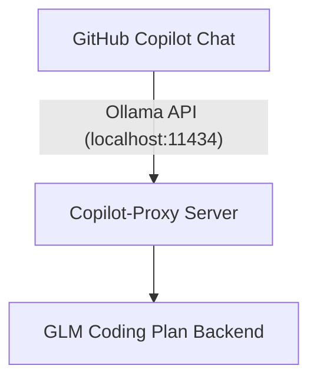

# Copilot-Proxy

A proxy server that bridges GitHub Copilot Chat with GLM coding models by mimicking the Ollama API interface.

Fork notice: this repo is a fork of `modpotato/copilot-proxy` with GLM streaming fixes and default think-tag handling.

## Quick start (minimum)

```powershell
# 1) Set your Z.AI API key for this shell
$env:ZAI_API_KEY = "YOUR_KEY"

# 2) Install dependencies (from this repo)
uv sync

# 3) Run the proxy (make sure Ollama isn't using port 11434)
uv run copilot-proxy serve --host 127.0.0.1 --port 11434
```

The server listens on `http://localhost:11434` by default (same port Ollama uses). Make sure Ollama itself is stopped to avoid port conflicts.

## Streaming fix: Copilot "silent stream" (GLM `reasoning_content`)

Some GLM / Z.AI backends stream tokens in `choices[].delta.reasoning_content` instead of `choices[].delta.content`. Many clients (including GitHub Copilot's Ollama integration) only render `delta.content`, which can look like a long pause and then a sudden full answer.

This proxy includes a compatibility shim for `/v1/chat/completions` with `stream=true`: it rewrites streamed SSE chunks by moving `delta.reasoning_content` into `delta.content` (and removes `reasoning_content`) so downstream clients see tokens continuously. Non-streaming responses are unchanged.

Why this is important:
- **Fixes "silent streaming"**: clients that ignore `reasoning_content` finally receive continuous `delta.content` tokens.
- **Avoids dropped output in clients that only build history from `delta.content`**: unwrapping ensures the client receives the full stream in the field it understands (even when the upstream model emits most tokens as `reasoning_content`).

Token usage impact:
- **Upstream (Z.AI/GLM) usage for a single request**: unchanged - this proxy does not change what the model generates; it only rewrites the streamed fields.
- **Downstream prompt size on later turns**: may increase if your client includes prior assistant `content` in the next request (because reasoning may now be part of that content). This proxy mitigates that by stripping `<think>...</think>` blocks from assistant history before forwarding upstream (enabled by default).

By default, the proxy wraps streamed reasoning in `<think>...</think>` tags (some chat UIs collapse this). To disable think tags:

```powershell
$env:COPILOT_PROXY_THINK_TAGS = "0"
```

Note: if you disable think tags, the proxy will still stream continuously (it will just stream the reasoning as normal `content`), but it won't be able to reliably strip reasoning from later turns.

By default, the proxy strips `<think>...</think>` blocks from assistant messages before forwarding the next request upstream (to prevent multi-turn prompt bloat). To keep `<think>` blocks in the upstream history, disable stripping:

```powershell
$env:COPILOT_PROXY_STRIP_THINK_TAGS = "0"  # disable (enabled by default)
```

Tip: stripping only works if the reasoning is wrapped in `<think>...</think>` (enabled by default). If you set `COPILOT_PROXY_THINK_TAGS=0`, the proxy can't reliably separate reasoning from the final answer.

To verify the fix, run a streaming request and confirm you see `delta.content` early (and never `reasoning_content`).
Tip: on Windows/PowerShell, pass the JSON body via stdin/file (don't put JSON with quotes directly on the command line).

```powershell
$payload = @{ model="GLM-4.7"; stream=$true; messages=@(@{ role="user"; content="Think step by step. Explain TCP slow start in 5 sentences." }) } | ConvertTo-Json -Compress

# Raw SSE stream
$payload | curl.exe -s --globoff -N http://127.0.0.1:11434/v1/chat/completions -H "Content-Type: application/json" --data-binary '@-'

# Sanity checks (first prints nothing; second prints lots of lines)
$payload | curl.exe -s --globoff -N http://127.0.0.1:11434/v1/chat/completions -H "Content-Type: application/json" --data-binary '@-' | Select-String -SimpleMatch '"reasoning_content"'
$payload | curl.exe -s --globoff -N http://127.0.0.1:11434/v1/chat/completions -H "Content-Type: application/json" --data-binary '@-' | Select-String -SimpleMatch '"content"'
```

## What it does

This proxy server intercepts requests from GitHub Copilot's Ollama provider and forwards them to a GLM coding plan backend. By implementing the Ollama API interface, it allows the GitHub Copilot VS Code extension to communicate with alternative language models seamlessly.



## Quick Start

### Prerequisites

1. **Python 3.10+**
2. **UV** for dependency management and packaging ([install instructions](https://docs.astral.sh/uv/getting-started/installation/))
3. **Z.AI Coding Plan access** with a valid API key

### Configure credentials

**New users (recommended):**
```powershell
# Interactive setup - runs automatically on first use
copilot-proxy

# Or manually run setup wizard
copilot-proxy config setup
```

**Advanced users - Environment variables:**
   ```powershell
   # PowerShell (current session only)
   $env:ZAI_API_KEY = "your-zai-api-key"
   ```

   ```bash
   # bash/zsh
   export ZAI_API_KEY="your-zai-api-key"
   ```

   You can optionally set a custom endpoint with `ZAI_API_BASE_URL`, though the default already targets the Coding Plan URL `https://api.z.ai/api/coding/paas/v4`.

**Configuration Management:**
```powershell
# Set API key in persistent config
copilot-proxy config set-api-key your-zai-api-key

# View current configuration
copilot-proxy config get-api-key

# Set custom base URL
copilot-proxy config set-base-url https://your-custom-endpoint.com

# Show config file location
copilot-proxy config show-path

# Start proxy (uses saved config automatically)
copilot-proxy serve

# Set context length (controls Copilot context window size)
copilot-proxy config set-context-length 128000

# View current context length (default: 64000)
copilot-proxy config get-context-length

# Set default model
copilot-proxy config set-model GLM-4.7

# View current model
copilot-proxy config get-model

# Set temperature (0.0 = deterministic, 1.0 = creative)
copilot-proxy config set-temperature 0.1

# View current temperature
copilot-proxy config get-temperature
```
**Priority Order:** Config file > Environment variables > Default values

### Configure GitHub Copilot in VS Code

   - Open the GitHub Copilot Chat panel in VS Code
   - Click on the current model name to view available models
   - Click **'Manage Models...'**
   - Select **'Ollama'** from the list of providers
   - Choose your preferred model from the available GLM models

### Available Models

The proxy advertises the GLM Coding Plan lineup so Copilot (or any Ollama-compatible client) can switch between them seamlessly:

| Model | Description | Concurrency |
|-------|-------------|-------------|
| `GLM-4.7` | Next-gen flagship with advanced "Vibe Coding" | 2 |
| `GLM-4-Plus` | High-throughput flagship variant | 20 |
| `GLM-4.6` | Flagship coding model with top-tier reasoning | 3 |
| `GLM-4.5` | Balanced performance for everyday coding | 10 |
| `GLM-4.5-Air` | Lightweight, faster response variant | 5 |
| `GLM-4.5-AirX` | Accelerated variant of the Air model | 5 |
| `GLM-4.5-Flash` | Ultra-fast, low-latency coding model | 2 |
| `GLM-4.6V` | Multimodal (Vision) flagship model | 10 |
| `GLM-4.6V-Flash` | Fast multimodal coding & analysis | 3 |
| `GLM-4.6V-FlashX` | Accelerated fast multimodal model | 3 |
| `GLM-4.5V` | Previous generation multimodal model | 10 |
| `AutoGLM-Phone-Multilingual`| Specialized mobile/agentic model | 5 |
| `GLM-4-32B-0414-128K` | Dense 32B parameter coding specialist | 15 |

> **Tip:** These identifiers match the GLM Coding Plan catalog, so any OpenAI-compatible tool can use them by pointing to `https://api.z.ai/api/coding/paas/v4` with your Coding Plan API key.

## How it Works

The proxy server implements the Ollama API specification, allowing GitHub Copilot's Ollama provider to communicate with it. When Copilot sends requests to `localhost:11434`, the proxy intercepts these requests and forwards them to the GLM coding plan backend, then returns the responses in Ollama-compatible format.

## Troubleshooting

**Common Issues:**

1. **Port conflict errors**
   - Ensure Ollama is not running (both services use port 11434)
   - Check that no other service is using port 11434
   - On Windows, use: `netstat -ano | findstr :11434`
   - On Unix/Linux/Mac, use: `lsof -i :11434`

2. **Ollama provider not responding in Copilot Chat**
   - Verify the proxy server is running
   - Check the terminal for any error messages
   - Ensure the GLM backend is accessible

3. **Models not appearing in VS Code**
   - Restart VS Code after starting the proxy server
   - Make sure you've selected 'Ollama' as the provider in Copilot settings
   - Check that the proxy server is responding at `http://localhost:11434`

4. **PowerShell curl request fails / "Invalid JSON body"**
   - Don't paste CMD-style escaped JSON into PowerShell.
   - Build the JSON with `ConvertTo-Json` and pass it via stdin: `--data-binary '@-'`.
   - If you pass a file, quote it: `--data-binary '@payload.json'` (unquoted `@...` is treated as splatting).

## Developing locally

```powershell
uv sync
uv run uvicorn copilot_proxy.app:app --reload --port 11434
```

Use `uv run pytest` (once tests are added) or `uvx ruff check .` for linting.

## License

This project is licensed under the MIT License - see the LICENSE file for details.
